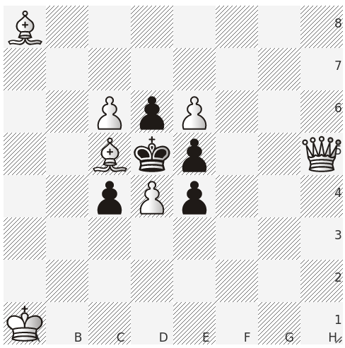
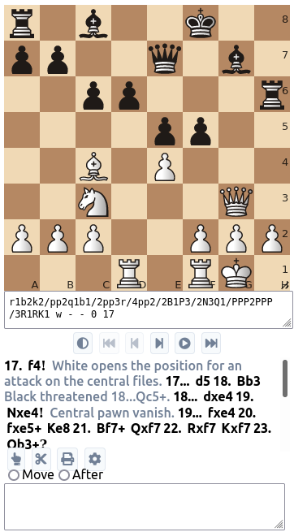

# PgnViewerJS

PgnViewerJS (as npm package named `pgn-viewer`) is a simple JavaScript implementation to show PGN files (Portable Game Notation == Chess)
in a web page. PgnViewerJS does not write everything anew, but it uses the following libraries:

* [chess.js](https://github.com/jhlywa/chess.js) Base library to model chess in JavaScript
* [Chessground](https://github.com/ornicar/chessground) The chessboard used by lichess.org
* [pgn-reader](https://www.npmjs.com/package/@mliebelt/pgn-reader) Backend for the viewer (part of this repository, but separately published)
* [pgn-parser](https://github.com/mliebelt/pgn-parser) My own parser based on [peggy](https://github.com/peggyjs/peggy) (formerly pegjs)

See the section Acknowledgments for more supporting libraries.

See the working examples on my new GitHub Pages site [PgnViewerJS](http://mliebelt.github.io/PgnViewerJS/),
especially the [Configuration Builder](http://mliebelt.github.io/PgnViewerJS/config/config.html) 
that demonstrates all parameters in a running example.

## Getting Started

The easiest way to use it is to install it by using NPM: `npm install @mliebelt/pgn-viewer`. You will find there the diretory `lib` that contains everything. Copy that onto your webserver.

### Example Screenshots

The following are example screenshots with the configuration set below, to show the rich possibilities of PgnViewerJS.





The screenshots show from left to right:

* `mode: board; theme: sportverlag`
* `mode: edit; headers: false; theme: 'brown'` with comments
* `mode: view; layout: 'left'; pieceStyle: 'leipzig'; notationLayout: 'list'` with comments

Go to the [github.io pages](http://mliebelt.github.io/PgnViewerJS/) (documentation), where the viewer is documented and shown.

### Features

This implementation has the following features:

* Allows to show one or many chess games complete, with a lot of different styles, themes, tuning, ...
* Allows to play through the games forward and backward, including variations.
* Allows to play from a legal position only legal moves.
* Knows all PGN notation elements, and knows how to render them.

### UI modes

There are four different kind of usages:

* `PGNV.pgnView` renders the whole game, and allows to play it through, jump to any position.
* `PGNV.pgnEdit` is a superset of pgnView, that allows to additional add variations, change the order of main line and variations, and other kind of interactions like adding comments, PGN notation elements, ...
* `PGNV.pgnBoard` will just show a position without any interaction possible.
* `PGNV.pgnPrint` will just show a whole chess game, without any interaction possible.

There is at the moment no way to save a game that was edited in `pgnEdit` mode. But you may at least copy the whole notation, and insert it again in the HTML code of your web page.

## Running the tests

* Run `npm test` in directory `modules/pgn-reader`. This runs the tests for the module `pgn-reader`.

## Running the examples

* Start a local webserver (like `http-server`) inside directory `modules/pgn-viewer`, and visit the page `http://localhost:<port>/examples`. 
* Browse through the many examples in the sub-directories, or visit the configuration builder in directory `examples/configuration/config.html`. 

## Deployment

### From Release

* Copy the files from directory `modules/pgn-viewer/lib` into a web server.
* Create new HTML files with the corresponding head and body.

### From Clone

* Clone the repository.
* Run `npm install` from the root, to ensure that all tools are installed.
* Run `npm install` in `modules/pgn-viewer` directory.  
* Run `npm run build` in `modules/pgn-viewer`) directory.
* Copy the files from the directory `modules/pgn-viewer/lib`.
* Create new HTML files with the corresponding head and body.

### Using the viewer

#### Standalone script

To use the viewer in an HTML page, you have to do the following steps:

* Include the necessary library `pgnv.js`.
* Include the necessary div container for rendering of the  board and the moves.
* Include JavaScript code inside your HTML page to call the viewer.

So a rough template will look like:

```html
<!DOCTYPE html>
    <head>
        <script src="lib/pgnv.js" type="text/javascript" ></script>
    </head>
    <body>
        <div id="board"></div>
        <script>
    	PGNV.pgnView('board',{ pgn: '1. e4 e5 2. Nf3 Nc6 3. Bb5', pieceStyle: 'merida' });
        </script>
    </body>
</html>
```

See the example in [react.md](react.md) how to run the viewer in a react application.

## Built With

* [NPM](https://www.npmjs.com/) For libraries, building, ...
* [Webpack](https://webpack.js.org/) For building optimized bundle.

## Contributing

If you find something strange (bug), expect some feature (feature) or just want to comment on anything, please file first a ticket in Github.

If you want to help in implementing something, clone the repository, change whatever you want to, and provide a pull request that I can look at.

## Versioning

We use [SemVer](http://semver.org/) for versioning. For the versions available, see the [tags on this repository](https://github.com/mliebelt/PgnViewerJS/tags).

From the version 1.0.0 on, the whole package can be downloaded / installed by using NPM:

* Download: `npm pack @mliebelt/pgn-viewer@1.5.9` Results in download of a file `mliebelt-pgn-viewer-1.5.9.tgz`, that contains in the directory `package/lib` all resources needed.
* Install: `npm install @mliebelt/pgn-viewer@1.5.9` as part of some other application. You will find then the files in the directory `node_modules/@mliebelt/pgn-viewer/lib`.

## Authors

* Markus Liebelt - [mliebelt](https://github.com/mliebelt)

## License

pgn-viewer is distributed under the **GPL-3.0 license** (or any later version, at your option), due to its use of [Chessground](https://github.com/ornicar/chessground).
When you use pgn-viewer for your website, your combined work may be distributed only under the GPL. **You must release your source code** to the users of your website.

Please read more about GPL for JavaScript on [greendrake.info/#nfy0](http://greendrake.info/#nfy0).

## Acknowledgments

We use the following libraries in the implementation:

* [chess.js](https://github.com/jhlywa/chess.js) Base library to model chess in JavaScript
* [Chessground](https://github.com/ornicar/chessground) The chessboard used by lichess.org
* [Mousetrap](https://craig.is/killing/mice) Binds keys to actions in the UI
* [roddeh-i18n](http://i18njs.com) Internationalization (== i18n) library to translate chess into current 18 languages. Strings are inlined in the library.
* [Timer.ts](https://github.com/fschaefer/Timer.js) Small timer for automatic moves
* [FontAwesome](http://fontawesome.io/) Nice icon font used for some buttons
* [PGN Specification](https://github.com/mliebelt/pgn-spec-commented/blob/main/pgn-specification.md) PGN (Portable Game Notation) specification
* [NAG Specification](http://en.wikipedia.org/wiki/Numeric_Annotation_Glyphs) Definition of the NAGs (Numeric Annotation Glyphs)
* [PGN Specification  Supplement](https://github.com/mliebelt/pgn-spec-commented/blob/main/pgn-spec-supplement.md) Addition for adding graphical elements, clock values, eval, ...

Thank you a lot to all contributors of issues.

### Known Usage

* [PgnJS](https://github.com/xeyownt/mwpgnjs) Plugin for Mediawiki that uses PgnViewerJS to display  chess games.
* [PgnViewerJS-WP](https://github.com/mliebelt/PgnViewerJS-WP) Plugin for Wordpress to show games with the help of PgnViewerJS
* [The Chess Centre](https://github.com/chess-centre/platform#special-thanks-) Replaying games produced by DGT live boards following OTB events.